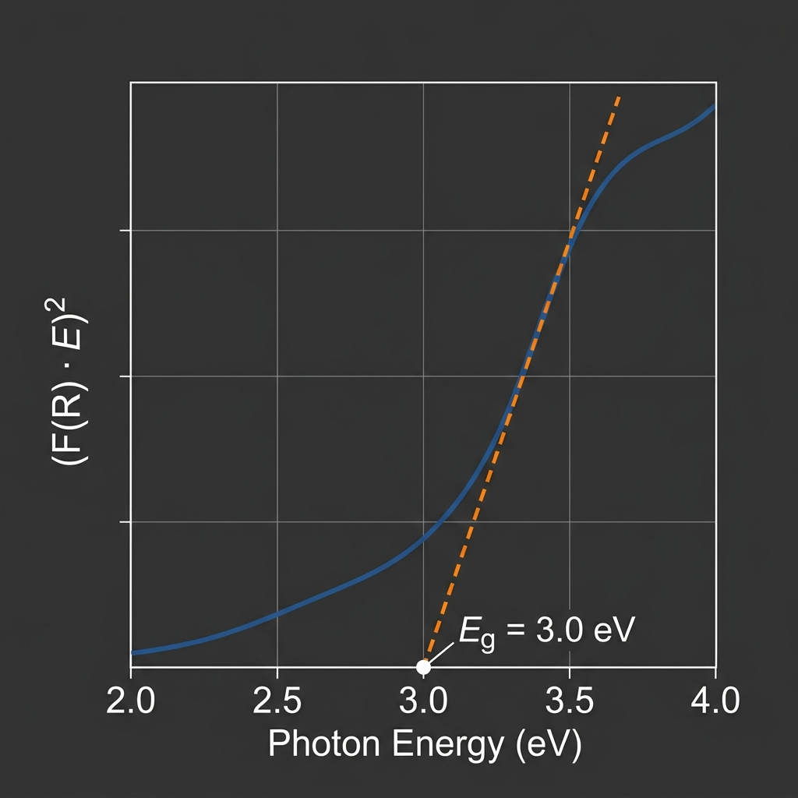

# optical-bandgap-tauc

[](https://pypi.org/)
[](https://opensource.org/licenses/Apache-2.0)
[](https://www.python.org/)
[](https://pytest.org/)

An automated, research-grade Python package and command-line tool (CLI) to process raw Diffuse Reflectance Spectroscopy (DRS) data, perform Kubelka-Munk conversions, and automatically locate the linear absorption-edge regime to extract optical band gaps ($E_g$) without subjective manual fitting.



---

## 💡 Why This Exists (Author's Motivation)

As a researcher working on transition metal oxide semiconductors (specifically defect-rich rutile and anatase $\text{TiO}_2$ photoanodes), I spent years running Diffuse Reflectance Spectroscopy (DRS) scans. If you are in materials science, you know the routine:
1. Export raw reflectance data from your spectrometer (Shimadzu, PerkinElmer, Varian).
2. Import the data into OriginLab or Excel.
3. Manually compute the Kubelka-Munk function $F(R)$ and the Tauc variable $(F(R) \cdot h\nu)^{1/r}$.
4. Spend hours dragging tangent cursors back and forth to find the "steepest linear regime" of the absorption edge.

This manual process is highly subjective. A reviewer can easily question your bandgap value by $\pm 0.05$ eV just by claiming you should have shifted your tangent lines. **`optical-bandgap-tauc` was born out of frustration to replace this guess-and-drag method with a mathematically rigorous, fully automated, and reproducible edge-fitting algorithm.**

Every band gap reported by this package is accompanied by the precise energy boundaries fitted and the mathematical method used. If a reviewer asks how you got your numbers, you can copy the citation blurb, paste the parameters, and know your results are $100\%$ reproducible.

— **raymsm** (Lead Developer & Materials Chemistry Researcher)

---

## 🔍 Core Algorithm (How It Works)

To mimic the human eye identifying the "straightest part of the rising edge" while avoiding noise artifacts, the tool implements a **derivative-plateau search** algorithm:

1. **Energy Conversion & Sorting:** Wavelength ($\lambda$) is converted to energy ($E = 1239.84198 / \lambda$) and sorted ascending.
2. **Kubelka-Munk Conversion:** Raw reflectance fraction $R$ is converted to $F(R) = (1-R)^2 / 2R$. Low values ($R=0$) are clipped to $10^{-10}$ to prevent division singularities.
3. **Adaptive Savitzky-Golay Smoothing:** The Tauc variable curve $y_n(E) = (F(R) \cdot E)^n$ is smoothed. To prevent high-frequency noise from corrupting derivatives, a second Savitzky-Golay pass is applied to the first derivative $dy/dE$ before computing the second derivative $d^2y/dE^2$.
4. **Plateau Search:** Finds the energy $E_{\text{peak}}$ of maximum slope (maximum $dy/dE$) and expands a candidate window outward in both directions as long as $dy/dE \ge 90\%$ of the maximum.
5. **Inflection Trimming:** Computes the second derivative $d^2y/dE^2$. Within the candidate window, it locates zero-crossings (inflection points) where the curvature exceeds $10\%$ of the peak curvature. The window is trimmed to stop *before* these inflections, preventing the fit from straddling the transition into the absorption saturation plateau or baseline.
6. **Anchored Curvature Cross-Check:** For validation, a second method searches for the maximum of $d^2y/dE^2$ restricted to the edge onset (where $dy/dE \ge 15\%$ of its peak) and fits a $0.15$ eV window. If the two methods disagree by $>0.05$ eV, a logger warning is issued.

---

## 📦 Installation

```bash
# Clone the repository
git clone https://github.com/raymsm/optical-bandgap-tauc.git
cd optical-bandgap-tauc

# Install in editable mode
pip install -e .

# Install with developer and testing packages (pytest, pytest-cov)
pip install -e ".[dev]"
```

---

## 🚀 Quick Start & Worked Example

### Single File Analysis
Run the automated analysis on a raw reflection data file:
```bash
bandgap-tauc analyze sample_data.csv --input-type reflectance-pct --transition all --output-dir ./results
```

**Terminal Output:**
```text
┌───────────────────────────────────────────────────────────────────────────────────────────────┐
│                               Optical Band Gap Results Summary                                │
└───────────────────────────────────────────────────────────────────────────────────────────────┘
  Sample     Transition Type         Eg (eV)    R²     Fit Window (eV)         Method         
 ───────────────────────────────────────────────────────────────────────────────────────────────
  T1_drs     direct-allowed            5.102  0.9998    6.138 - 6.199    fallback           
  T1_drs     indirect-allowed          2.771  0.9997    3.241 - 3.568    derivative-plateau 
  T1_drs     direct-forbidden*         2.921  0.9998    3.289 - 3.647    derivative-plateau 
  T1_drs     indirect-forbidden        2.499  0.9998    3.208 - 3.497    derivative-plateau 
 ───────────────────────────────────────────────────────────────────────────────────────────────
 * denotes recommended transition type
```

### Directory Batch Mode
Process a folder containing multiple spectra:
```bash
bandgap-tauc batch ./raw_spectra/ --output-dir ./results --transition direct-allowed
```
This writes individual sample JSON/CSV files, generates individual annotated Tauc plots, compiles a combined comparison sheet (`batch_summary_comparison.csv`), and overlays all Tauc curves on a single overlay plot for publication-ready figures.

---

## 🛠️ CLI Arguments Reference

* `--input-type` (`reflectance-pct`, `reflectance-frac`, `absorbance`): Select input data column format. (Default: `reflectance-pct`, i.e. $0 - 100\%$).
* `--transition` (`direct-allowed`, `indirect-allowed`, `direct-forbidden`, `indirect-forbidden`, `all`): Select which transitions to model. (Default: `all`).
* `--smooth-window`, `--smooth-order`: Manually override the adaptive Savitzky-Golay filter defaults.
* `--edge-window-ev`: Bypasses the auto-regime detection and fits a fixed energy span (eV) centered around the maximum derivative peak.
* `--no-plot`: Suppress plot generation (ideal for high-throughput headless scripts).

---

## 📈 Citation & Methodology Blurb

If you use this tool in your research, please include the following citation statement in your experimental/methods section:

> *"Optical band gaps ($E_g$) were extracted via automated Tauc plot analysis using the open-source python utility `optical-bandgap-tauc` (v0.1.0, developed by raymsm). The software converts diffuse reflectance to the Kubelka-Munk function $F(R)$, converts wavelength to photon energy $E$ (eV), and computes the Tauc variable $(F(R) \cdot E)^n$. The linear absorption-edge regime was automatically located using a derivative-plateau search algorithm with a derivative threshold of 90%, boundary-checked against zero-crossings in the second derivative ($d^2y/dE^2$) smoothed with a Savitzky-Golay filter. A least-squares linear fit was applied on the detected window to extrapolate the band gap energy intercept ($E_g = -c/m$)."*

---

## 🏷️ SEO Indexing & Keywords
`tauc plot python` | `optical bandgap calculator` | `kubelka-munk converter` | `spectroscopy data analysis` | `materials science python` | `rutile tio2 bandgap` | `black tio2 tauc plot` | `diffuse reflectance spectroscopy` | `savitzky-golay smoothing` | `automatic linear edge detection`
